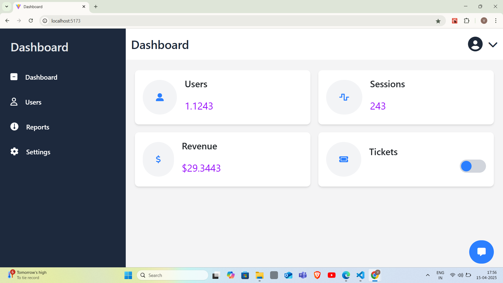
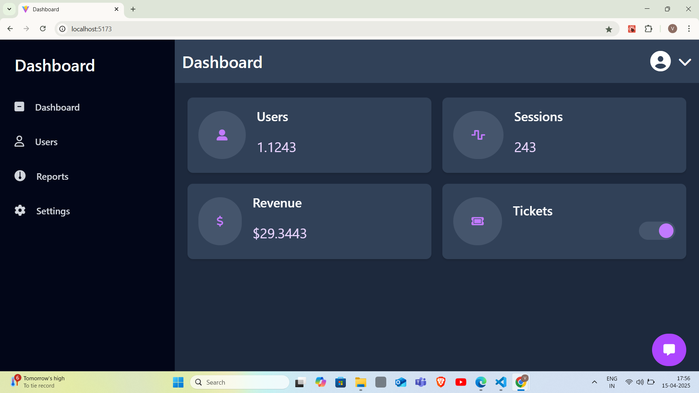
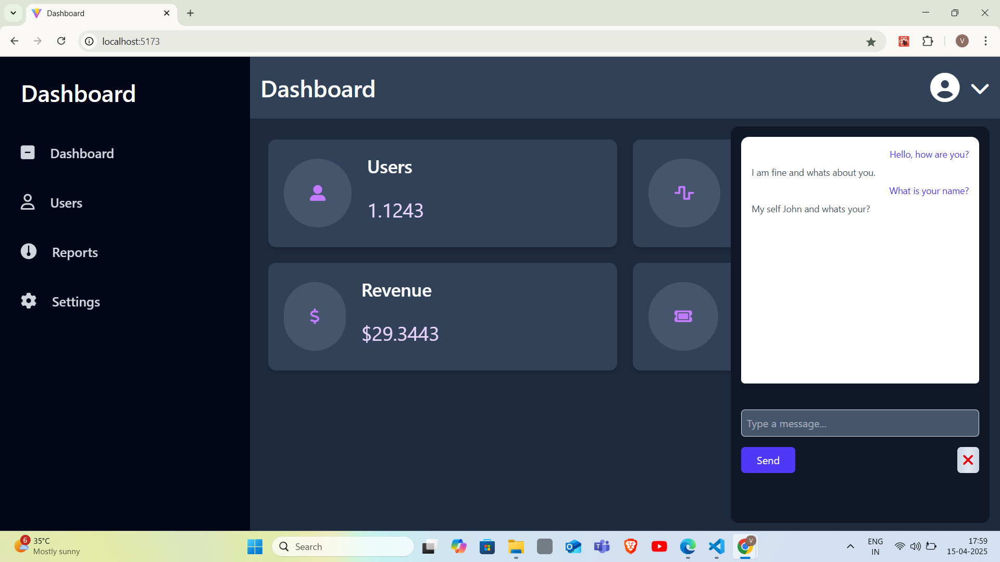
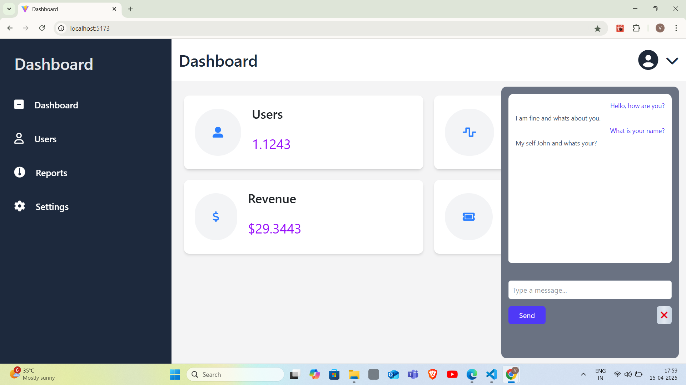
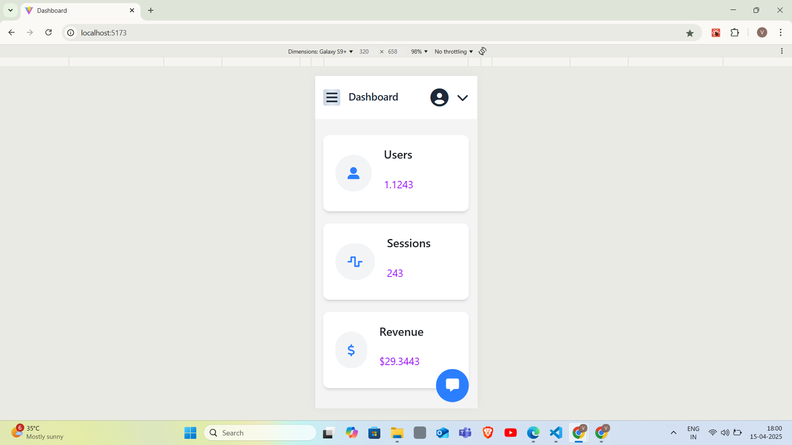
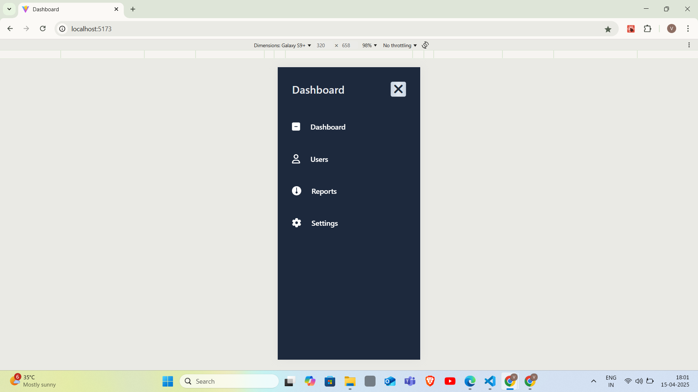
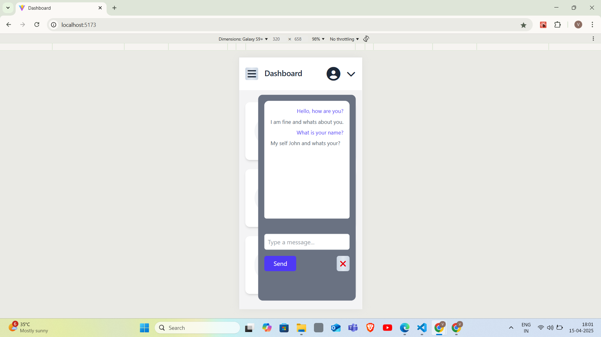
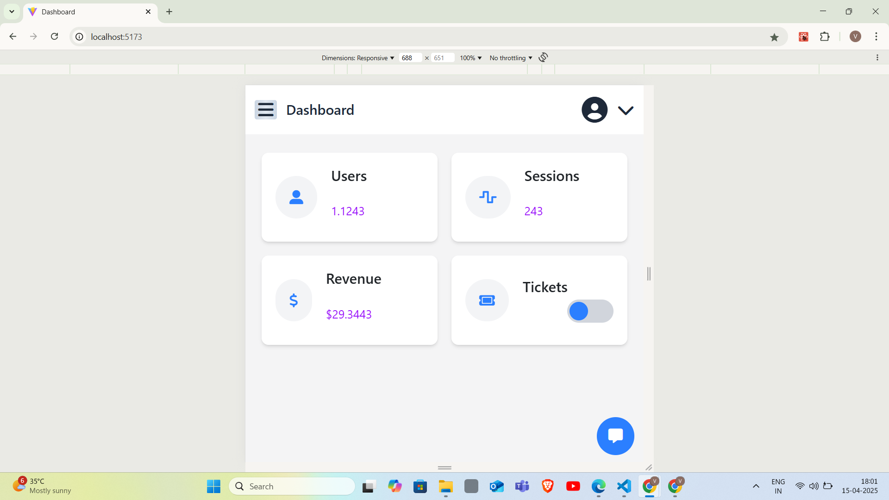
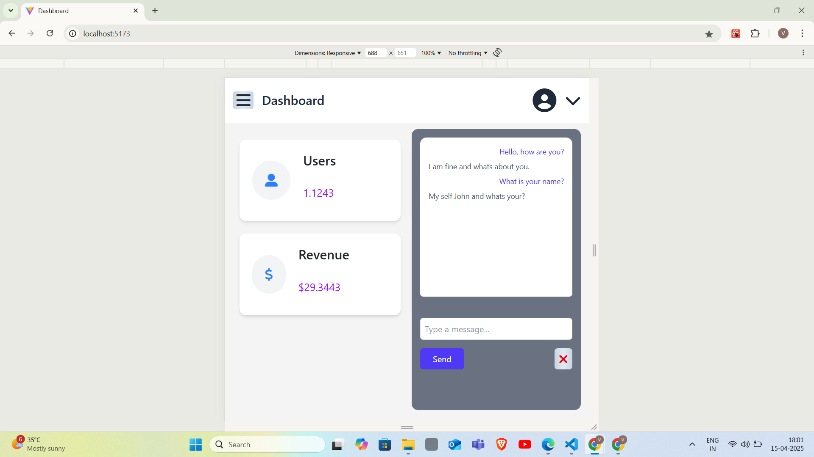
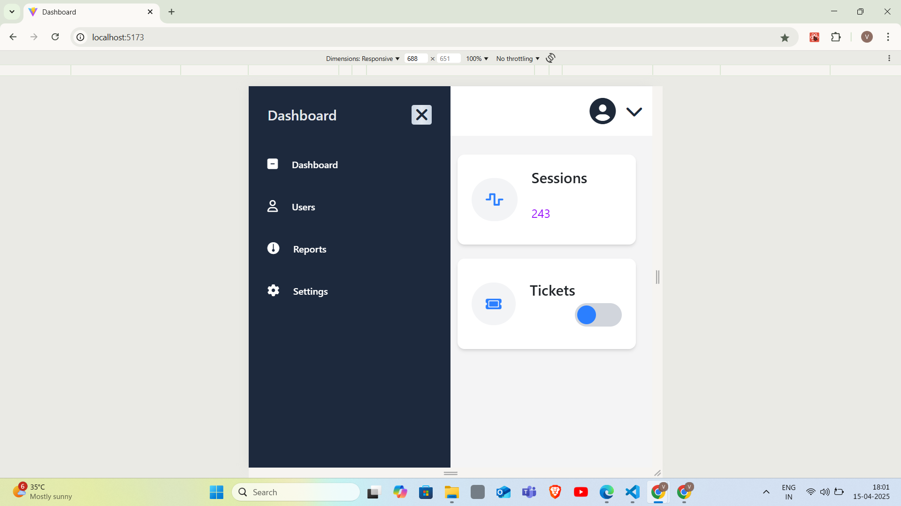

# Dashboard Analytics Platform

A responsive dashboard with dark mode support, and interactive metrics visualization.

## Features
- Dark/Light mode toggle
- Responsive sidebar with hover animations
- Metric cards with dynamic visual effects
- Mobile-first design
- Interactive UI components

## Setup Steps

1. **Clone Repository**
   ```bash
   git clone git repo link

2. **Install Dependencies**
   ```bash
   npm install

3. **Add Font Awesome CDN**
   * Add to public/index.html:
      ```html
      <link rel="stylesheet" href="https://cdnjs.cloudflare.com/ajax/libs/font-awesome/6.4.0/css/all.min.css">


4. **Configure Tailwind**
   * Ensure tailwind.config.js contains:
      ```js
      module.exports = {
         darkMode: 'class',
         // ... rest of config
      }

5. **Run Application**
   ```bash
   npm run dev

## Project Structure
```
my-app/
├── public/
├── src/
│   ├── components/
│   │   ├── Card.jsx
│   │   ├── ChatButton.jsx
│   │   ├── ChatModal.jsx
│   │   ├── Navbar.jsx
│   │   └── Sidebar.jsx
│   ├── App.js
│   └── index.js
└── README.md
```

## Screenshots
1. **Light Mode**

   


2. **Dark Mode**

   

3. **Chat Modal**
   
   

4. **Mobile View**
   
   
   
   
   
   